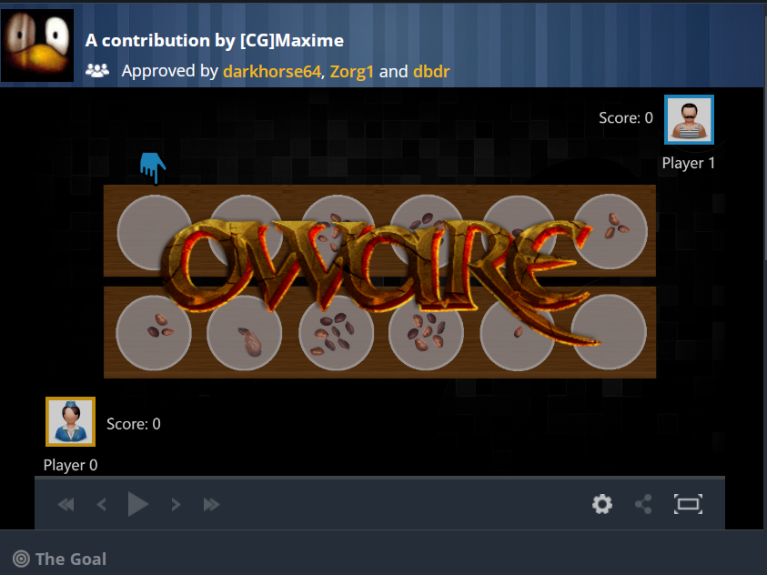
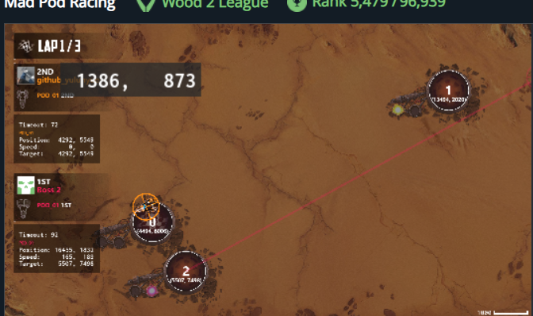

# TheDev

[](https://github.com/yulunyue/TheDev)
[](LICENSE)
[](https://github.com/yulunyue/TheDev/commits)

> 这是一个杂乱的项目，承载了一个野生程序员几年的时间在写代码这件事上的挣扎与思考。
> 
> 取名 `dev` 是希望它永远正在开发中——只有一个开发分支，也不会有 Release 版本。

---

## 📚 目录

- [项目特点](#项目特点)
- [技术栈](#技术栈)
- [项目内容](#项目内容)
- [编程哲学](#编程哲学)
- [快速开始](#快速开始)

---

## 🎯 项目特点

### 一个简洁的 Python 后端

**基于 Tornado 框架**

选择 Tornado 的原因：
- ~~基于协程的高性能 HTTP 服务~~
- ~~良好的架构设计~~

**真正的原因**：它支持 WebSocket，可以做一些与前端实时通信的东西

### 一个简洁的 TypeScript 前端

**仅使用 Webpack**

相信在没有 Vue、React、Angular 的情况下，前端开发也能很舒服。

> 前端复杂性主要源于 JavaScript 的弱类型，因此采用 TypeScript。
> 
> 当然，Vue、React、Angular 也都是不错的框架！

### 无数据库设计

使用 JSON 文件存储，简洁高效。

> 但在文件读写模块中预留了数据库接口，希望有朝一日因业务性能瓶颈需要时，能够无缝接入数据库。

---

## 🛠️ 技术栈

| 类别 | 技术 | 说明 |
|------|------|------|
| **后端** | Python + Tornado | WebSocket 实时通信 |
| **前端** | TypeScript + Webpack | 无框架，强类型开发 |
| **存储** | JSON | 简洁文件存储 |

---

## 📦 项目内容

### 🎮 算法与编程题目

#### CodingGame OwareAlpha

一个经典的策略游戏实现

- [📖 文档](doc/algo/game/oa/readme.md)
- [🎯 游戏链接](https://www.codingame.com/ide/puzzle/oware-abapa)



#### CodingGame Mad Pod Racing

太空赛车模拟游戏

- [📖 文档](doc/algo/game/mpr/readme.md)
- [🎯 游戏链接](https://www.codingame.com/ide/puzzle/mad-pod-racing)



### 🎪 Web 小游戏

探索有趣的 Web 交互体验

### 🔧 杂七杂八的工具

收集的各种实用工具和代码片段

---

## 💡 编程哲学

本项目倡导的编程原则：

1. **尽量扩展代码，少新增代码**
   - 感觉不好的东西就该删除，保持代码简洁

2. **相信问题没有想象中那么难**
   - 大多数人并不笨，那些难题也没有想象的那么难
   - 只是需要一个合适的场景和合适的人帮你真正理解问题

---

## 🚀 快速开始

### 后端

```bash
# 安装依赖
pip install tornado

# 运行服务
python app.py
```

### 前端

```bash
# 安装依赖
npm install

# 开发模式
npm run dev

# 构建生产
npm run build
```

---

## 📝 TODO

查看 [Todo 列表](doc/todo.md) 了解正在进行和计划的工作

---

## 📄 License

MIT License - 详见 [LICENSE](LICENSE) 文件

---

**最后更新**：2026年4月26日
